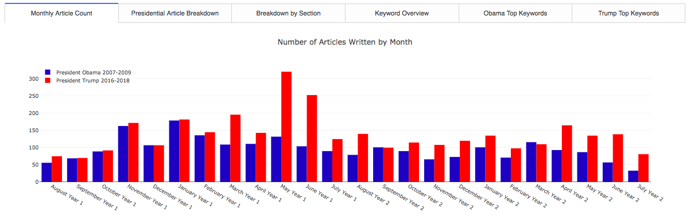
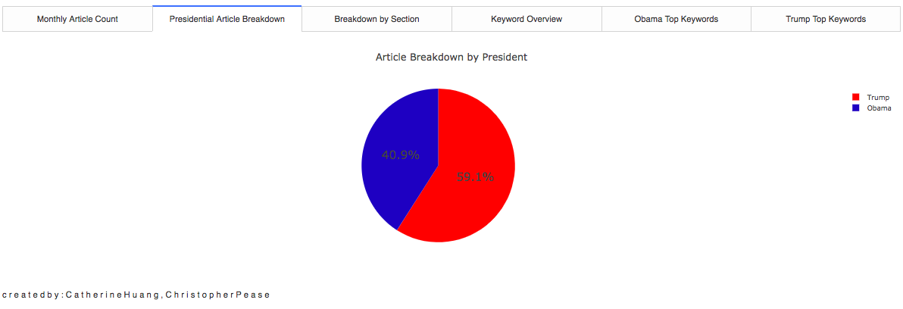
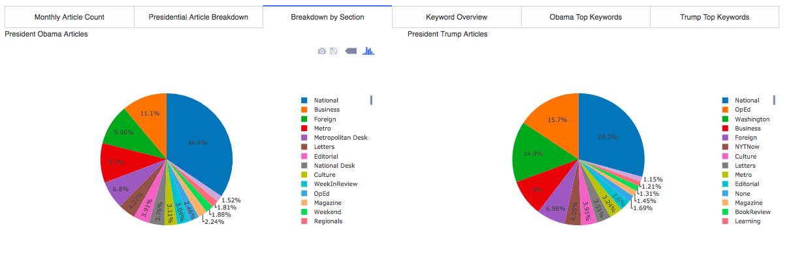
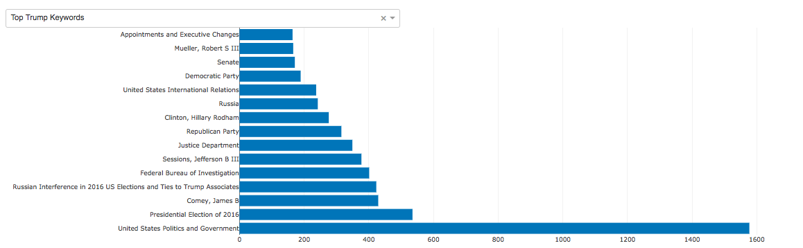
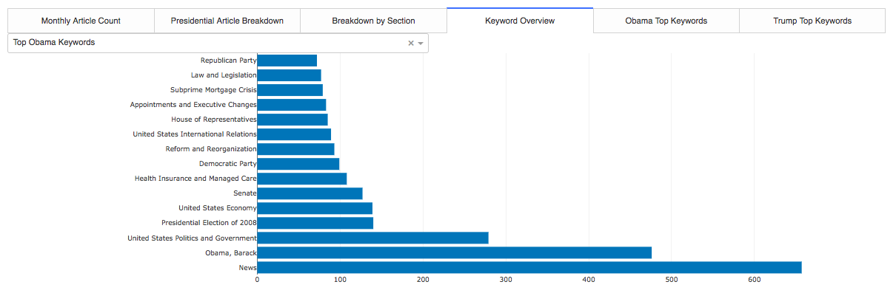

# Comparing and Visualizing New York Times coverage of Presidents Obama and Trump

# Project Motivation: 
In this project, we used the article search API provided by the New York Times to pull data for articles related to Presidents Obama and Trump. A relational SQL database was created to store article data, spanning equivalent two-year periods during each presidency. We hope you find the visualization of the data insightful. 

# ETL
The New York Times API provided many data points for each article, and the following were chosen for our analysis:
* Keywords
* Section
* Date
* Headline

For each of the presidents, we queried a two year period starting from 6 months before office to 18 months post-inauguration. This range allowed us to compare the news coverage for the presidents during similar timeframes. Our queries yielded 6000 articles in total.

# SQL Database Schema
The ORM SQLAlchemy was used to construct the schema for the SQL database. The entities in our database were presidents, articles and keywords, with one to many and many to many relationships respectively.

# Overview of the NYT presidential coverage article count 

  

The total article count per month for each of the presidential candidates are compared in the graph above. President Obama's article count is shown in blue, and President Trump's count is showed in red. This graph allowed us to compare and contrast the numbers of the articles The New York Times covered under each of the presidents, and help us uncover the topics in which NYT had dedicated significant time to cover. For example, the  spike in President Trump's article count in May and June of 2016 is mainly contributed by the topics based on the president's firing of James Comey, who was the director of the FBI at the time. 

# Article breakdown by presidents

  

The above visual provided an overview of the number of articles covered by The New York Times for each of the presidents. It shows that there are 18% more articles covered by the newspaper on President Trump than on President Obama during the same time period. 

# Presidental article topic comparison 

  

A side-by-side comparison of the sections in which the articles were covered under for each presidents. National sections were the dominate sections for both presidents. While the Business section is the second highest section for President Obama, Op-Ed is the second highest for President Trump. 

# Keyword Overview 
These interactive visualizations showed the most popular keywords for each of the president tagged by the New York Times. Each president keywords also featured a drop-down tool that allowed one to examine the top keywords associated with the articles broken down by People, Subject, Organization, and Location types. 

  
  

The most interesting result is the contrast between the top keywords for each president. Undoubtedly these will be shifted slightly as President Trump's term progresses. A possible explanation for the difference is a change in the way that NYT writers attribute different keywords to the article as there is likely not a concrete procedure for assigning these tags.

# Next steps: 
* explore different news sources and their coverage of the two presidents, to see how media institutions with different viewpoints differ in how they cover the presidents. 
* expand the news source to include Twitter, which is a less filtered and unedited view of the general public's sentiment on presidential news coverage. 
* Leverage natural language processing to gauge the sentiment of the newspaper coverage on the presidents by headlines, or by the actual content of the article. 
